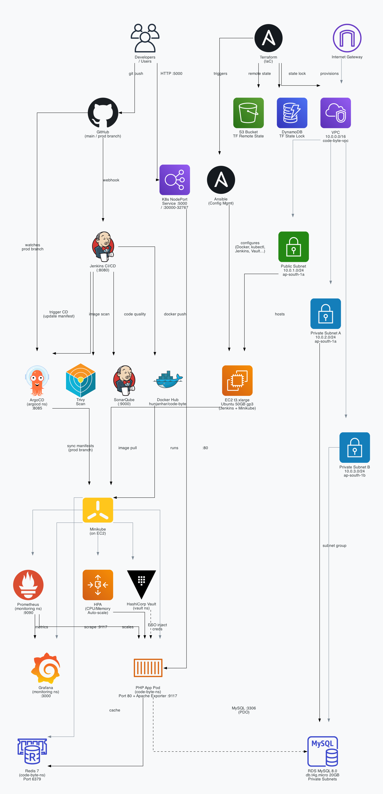
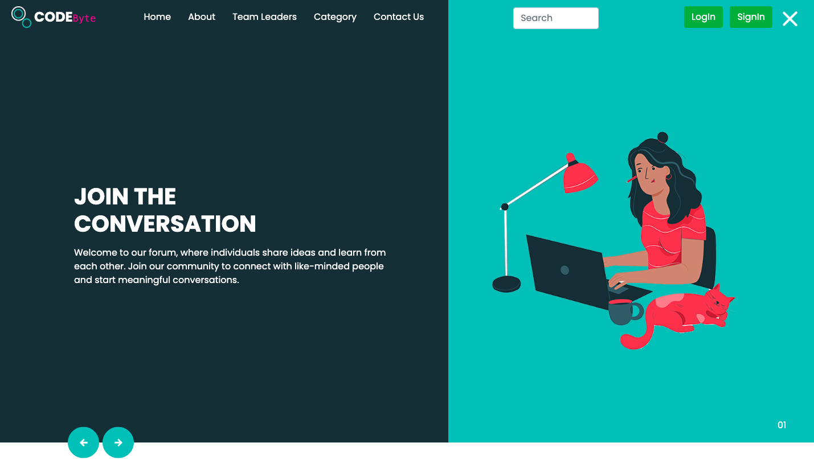
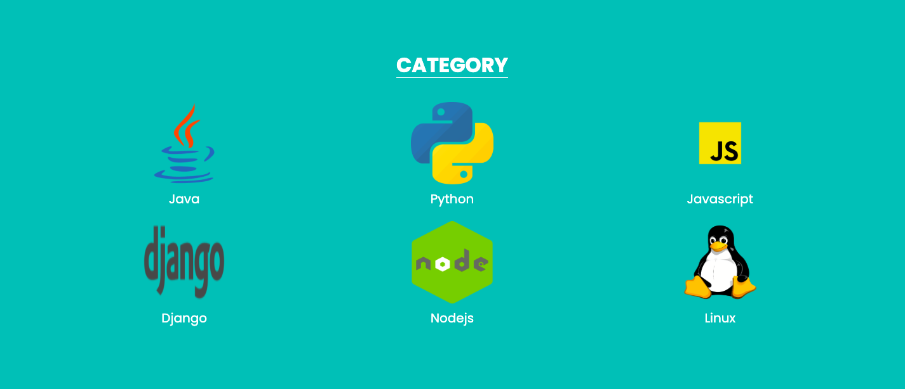
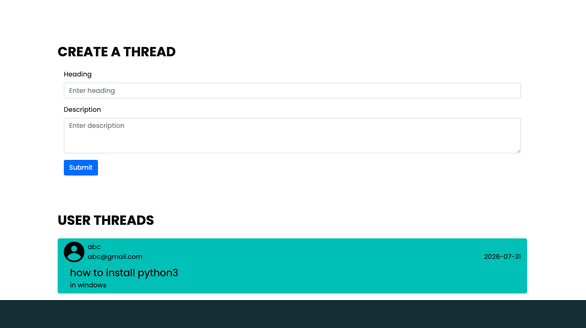
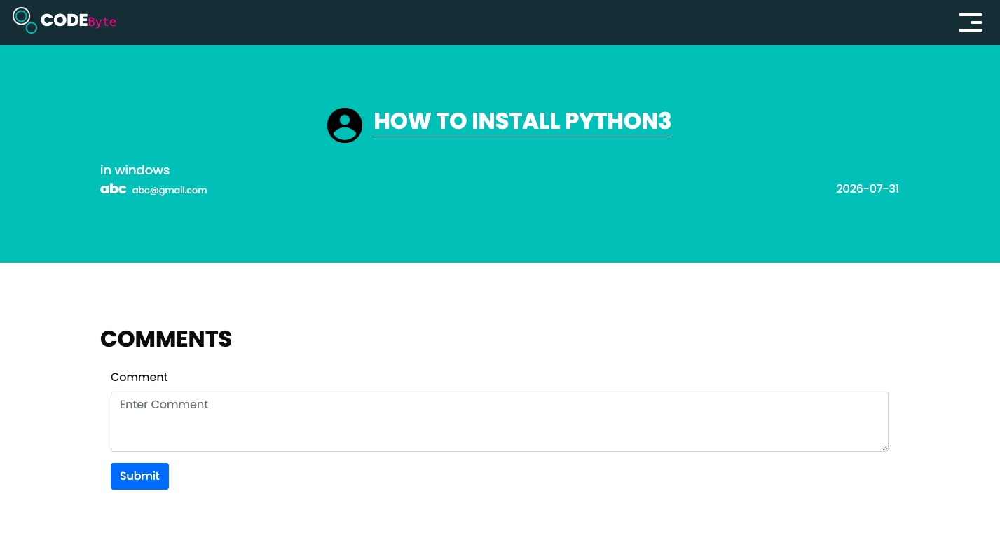

# Code-Byte

A PHP-based developer community platform for sharing coding threads, comments, and category-based discussions — containerised with Docker and deployed on ec2 inside a minikube using a full GitOps CI/CD pipeline.



---

## Overview

Code-Byte is a community-driven developer forum built with PHP 8.2. It lets users register, post threads, leave comments, search topics, and browse content by category. The project is designed as a production-grade DevOps showcase — from infrastructure provisioning with Terraform to GitOps-driven deployment via ArgoCD.






---

## Project Structure

```
code-byte/
├── .jenkins/
│   ├── Jenkinsfile.ci          # CI pipeline: build, scan, push image
│   └── Jenkinsfile.cd          # CD pipeline: deploy to EKS via ArgoCD
├── argocd-config/
│   ├── argocd.yml              # ArgoCD Application manifest
│   └── argocd-monitor.yml      # ArgoCD monitoring app
├── k8s
│   └── prod-deployment/        # Production manifests (GitOps source of truth)
├── terraform/
│   ├── provider.tf             # AWS provider (ap-south-1)
│   ├── vpc.tf                  # VPC, subnets, IGW, route tables
│   ├── main.tf                 # EC2 instance + Security Groups
│   ├── rds.tf                  # RDS MySQL instance
│   ├── resources.tf            # Ansible inventory + null_resource trigger
│   ├── output.tf               # Outputs: EC2 IP, RDS host/user/password
│   └── playbooks/              # Ansible roles for server configuration
├── remote-infa/
│   ├── s3.tf                   # S3 bucket for Terraform remote state
│   └── dynamdb.tf              # DynamoDB table for state locking
├── vars/
│   ├── checkCode.groovy        # Shared library: Git checkout helper
│   ├── securityScanners.groovy # Shared library: Trivy + Gitleaks
│   └── dastScan.groovy         # Shared library: OWASP ZAP DAST scan
├── controller/                 # PHP controllers (login, signin, comments…)
├── middleware/                 # PHP session verification middleware
├── components/                 # Reusable PHP view components (header, footer)
├── static/                     # CSS, JS, images (Bootstrap, jQuery)
├── database/
│   └── database.php            # PDO MySQL connection helper
├── codebyte.sql                # Database schema + seed data
├── Dockerfile                  # Multi-stage PHP 8.2-alpine image
└──  docker-compose.yml          # Local dev stack (app + MySQL + Redis)
```

---

## CI/CD Pipeline

### Continuous Integration (`Jenkinsfile.ci`)

Triggered on every push to the `main` branch.

```
Validate & Cleanup
      ↓
Fetch Source Code  (shared library checkout)
      ↓
Run Test Case       (php -l syntax check)
      ↓
Security Scans      (Gitleaks + Trivy filesystem)
      ↓
SonarQube Analysis  (code quality gate)
      ↓
Export Docker Tag   (<build_number>-<git_short_sha>)
      ↓
Docker Build & Scan (Trivy image scan)
      ↓
Push to Docker Hub  (tag + latest)
      ↓
Trigger CD Pipeline (passes IMAGE_TAG + APP_ENV)
```

### Continuous Deployment (`Jenkinsfile.cd`)

Triggered automatically by the CI pipeline.

```
Cleanup Workspace
      ↓
Git Checkout (prod branch)
      ↓
Verify Image on Docker Hub
      ↓
Update & Validate K8s Manifest  (sed + dry-run)
      ↓
Manage Vault & K8s Secrets      (inject DB/Redis creds into Vault, run DB migration)
      ↓
Validate Environment
      ↓
Update Manifest & Git Push      (commit new image tag → prod branch)
      ↓
Apply ArgoCD Manifests          (idempotent — skipped if already exists)
      ↓
Sync & Check ArgoCD Status      (wait for Succeeded + Healthy)
      ↓
Port Forwards                   (ArgoCD :8085, Grafana :3000, Prometheus :9090, App :5000)
      ↓
OWASP ZAP DAST Scan
```

Email notifications (HTML) are sent on both success and failure.

---

## Environment Variables

| Variable | Description |
|---|---|
| `DB_HOST` | MySQL host (RDS endpoint in prod, `db` in local) |
| `DB_USER` | MySQL username |
| `DB_PASSWORD` | MySQL password |
| `DB_NAME` | MySQL database name |
| `DB_ROOT_PASSWORD` | MySQL root password (blank = allow empty) |
| `REDIS_HOST` | Redis hostname |
| `REDIS_PORT` | Redis port (default `6379`) |

---

## Security Highlights

- **Gitleaks** — scans Git history for leaked secrets on every CI run.
- **Trivy** — scans both the filesystem and the built Docker image for CVEs.
- **OWASP ZAP** — DAST scan against the live deployment on every CD run.
- **SonarQube** — static code analysis with a quality gate.
- **Non-root containers** — app runs as UID 10001 with a read-only root filesystem.
- **RDS in private subnets** — database is not publicly accessible; only reachable from EC2 SG.
- **Vault + ESO** — zero secrets in Git or K8s manifests.

---

## Licence

See [LICENCE](./LICENCE).
